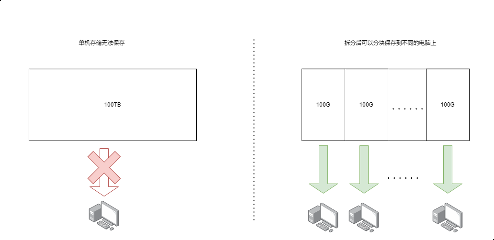
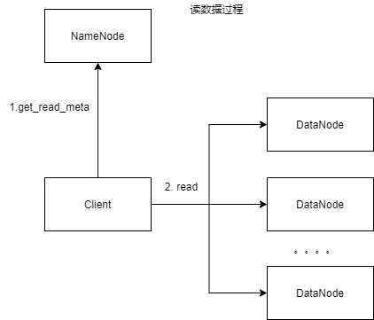
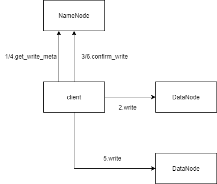

[TOC]
# 写在前面
这里的设计是为了简要的理解一个分布式系统有哪些东西，仅当作参考学习用，需要了解，但不是重点

# 大数据对存储的需求
大数据的大最直接的表现就是数据的规模大，大数据里一张表(如果不熟悉表的概念可以理解成Excel文件)的大小可以达到几十甚至上百TB, 单机很难存储，所以我们需要一个工具把一份很大的数据**分开存储**在多台机器上，同时也能让我们很**方便的访问**。
这个工具就是我们说的分布式存储系统。

# 最基础的设计

## 数据拆分
既然单个文件太大了，那么可以把大文件拆分成多个文件块，然后将文件块保存到不同电脑上，这样就能够保存下来了。


虽然数据保存下来了，但是现在有一个问题没有解决，就是我们没有办法读取数据了，因为我们不知道哪台电脑上保存了哪个文件块。 所以我们需要额外记录一下哪台电脑保存了哪个文件块，这样我们才能正确的读取数据.


## 结构设计

### 客户端/client
把分布式存储系统当初一个服务的话, 作为从这个服务上读写数据的用户，我们自然需要一个客户端去访问这个服务
### NameNode
把保存着“哪台电脑保存了哪个文件块”的这台电脑叫做NameNode，简称NN，照抄的Hadoop的命名，高兴的话取名叫MetaDadaBase或者StorageManager等等都可以，总之我们需要(至少)一台机器能够告诉我们可以到哪个电脑上找文件块就行了。
### DataNode
保存着文件块的电脑叫DataNode，简称DN
### 示意图


## 数据的读写过程

### 读数据
由于可以在NN上记录每个文件块的大小，所以读数据时我们可以从文件的任意位置开始读取。
一种可行的过程如下(拍脑门想的，可以选择其他的实现方式):

1. 客户端将要访问的文件名称和开始读取的位置(offset),要读取的数据量发送给NN, NN返回需要读取的文件块(列表)的元数据，包括:
    - DN的ip和端口号 (去哪拿文件块)
    - 文件块的id (拿哪个文件块)
    - 文件块开始对应于整个文件的偏移(offset)和文件块的长度 (文件块和原文件的关系)
2. 客户端根据拿到的元数据访问DN， 和DN建立网络连接来读取文件块


### 写数据

#### 只支持追加写
由于NN中记录了每个DN的文件块的起始偏移，支持随机写需要对NN中的数据进行变更，比较麻烦，所以只支持追加写和覆盖写。(实际hadoop不支持随机写是设计上对需求和性能的一种权衡，可以搜一下相关内容，有比较详细的分析)

#### 写数据流程

1. 客户端将要写的文件名、写的方式发送给NN, NN返回需要写的文件块的元数据，包括:
    - DN的ip和端口号 (写到哪)
    - 文件块的id (写哪个文件)
    - 开始写的文件块偏移及可以写的总长度
2. 客户端根据拿到的元数据和DN建立网络连接，写相应的数据块
3. 在完成一个数据块的写入或写入完成后，告知NN在文件块内写入的总长
4. NN更新元数据信息并返回客户端确认写入完成
5. 如果没有完成数据写入，重复步骤1

# 缺陷
这些缺陷通常不是了解大数据的核心问题(但是确实是分布式存储系统需要考虑的，如果你是设计分布式存储系统的，需要更多的考虑这些)。 之后会在相关的地方更深的介绍。
1. 没有做数据的多副本，通常在对**重要数据的处理**和**数据治理**的一些问题上会对多副本的问题进行考虑。
2. NN是单节点，挂了之后服务就挂了： 仅供学习用，挂就挂了
3. NN如果磁盘坏了，整个分布式存储服务就坏了: 同上
4. DN可能挂掉: 通常通过多副本的方式解决
5. 读取数据远近的问题: 通常HDFS在读取数据时会就近读取，这点能在大数据计算中节省很多的时间，需要讨论时再进一步讨论。但是学习用的系统就随便了。

# 接口设计
DN和NN的采用thrift来提供接口

## DN

### 读数据
|接口名称|参数|返回内容|说明|
|-|-|-|-|
|read|<li>block_id (int64): 文件块ID</li><li>offset(int64): 需要读取的开始位置(相对于该文件块)</li><li>length(int64): 要读取的数据长度</li>|字符数组,表示读取到的文件内容|从DN读数据|
### 写数据
|接口名称|参数|返回内容|说明|
|-|-|-|-|
|write|<li>block_id (int64): 文件块ID</li><li>offset(int64): 需要写的开始位置(相对于该文件块)</li><li>length(int64): 要写的数据长度</li><li>data(binary): 要写入的数据内容</li>|bool，成功或失败|向DN写数据|

## NN
|接口名称|参数|返回内容|说明|
|-|-|-|-|
|get_read_meta|<li>path(string): 文件全路径</li><li>offset(int64): 需要读取的开始位置(相对于该文件)</li><li>length(int64): 要读取的数据长度</li>|List\<ReadMetaData\>, ReadMetaData包括<li>ip(string):文件块所在DN的IP</li><li>port(int32):DN服务所在端口号</li><li>id(int64):文件块ID</li><li>offset(int64):文件块起始位置相对于文件的偏移</li><li>length(int64):文件块的长度</li>|从NN获取读数据时候的元数据信息|
|get_write_meta|<li>path(string): 文件全路径</li><li>mode(Enum{1:Overwrite, 2:Append}):写入的方式</li>|List<\WriteMetaData>, WriteMetaData包括: <li>ip(string):文件块所在DN的IP</li><li>port(int32):DN服务所在端口号</li><li>id(int64):文件块ID</li><li>offset(int64):开始写的位置相对于该文件块的偏移</li><li>length(int64):可写的的总长度</li>|从NN获取写数据时候的元数据信息|
|confirm_write|<li>id(int64):写入的文件块id</li><li>mode(Enum{1:Overwrite, 2:Append}):写入的方式，仅在覆盖写的第一个文件块确认时为Overwrite</li><li>length(int64):写入数据的总长度</li>|bool,成功或失败|客户端确认已经完成了对DN的写入|


# 调用流程

## 读数据


## 写数据
注意: 和读数据不同，写数据必须在写完一个文件块并确认写入完毕后再写入下一个文件块



# NameNode 的元数据存储

NameNode的元数据我们在内存中以dict的形式保存一份便于访问，同时定期把数据dump到磁盘上，这样可以方式NameNode服务挂掉/断电等情况的数据丢失。另外，参考Hadoop，我们也写一份元数据变化的日志(edit log)保存到磁盘上来记录元数据从上一次dump之后的变化。

## 内存存储

元数据的以dict格式保存，以路径为字典的分层, 每层的属性以 "/xxx"的形式添加，如 "/local/users/sinianluoye/1.txt" 记录为

```py
{
    "local": {
        "users": {
            "sinianluoye": {
                "1.txt" : {
                    "/type": "f", # file
                    "/blocks": [
                        {
                            "id": 1, # 文件块ID
                            "offset": 0, # 起始点相对于整个文件的偏移
                            "length": 8192, # 已有数据长度
                            "ip": "127.0.0.1" # DN所在IP
                            "port": 1234, # DN所在port
                            "capacity": 65536 # 当前文件块的总容量
                        }
                    ]
                }
            },
            "/type": "d"
        },
        "/type": "d"
    },
    "/type": "d" # directory
}
```
文件块结构包含的属性如上，在查找offset所在文件块时可以通过二分查找来快速定位

## 定期dump

为了保存快速，可以用二进制的方式对元数据进行dump，然后我们可以提供一个小工具将dump的文件翻译成json的格式


## Edit Log
