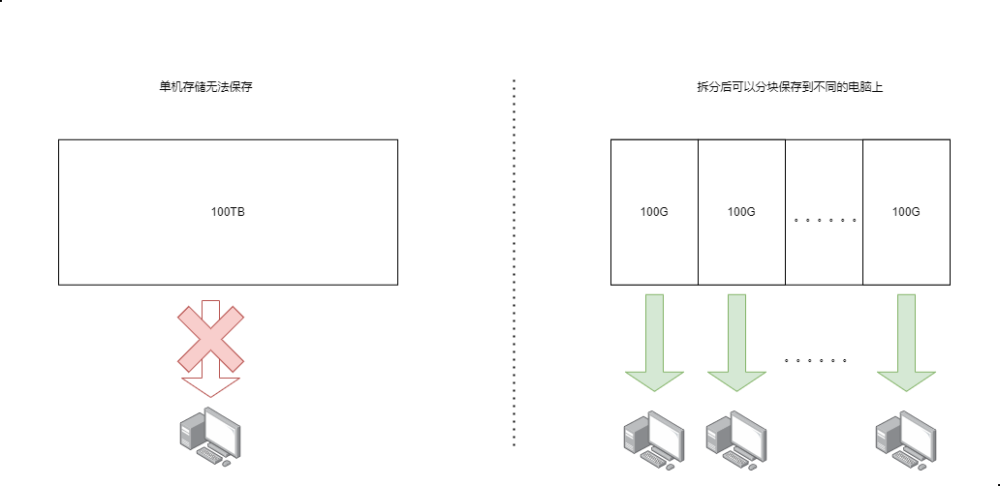
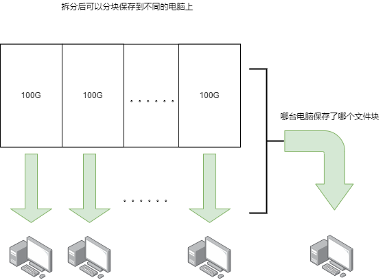
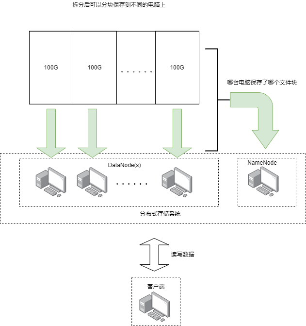

[TOC]

# 大数据对存储的需求
大数据的大最直接的表现就是数据的规模大，大数据里一张表(如果不熟悉表的概念可以理解成Excel文件)的大小可以达到几十甚至上百TB, 单机很难存储，所以我们需要一个工具把一份很大的数据**分开存储**在多台机器上，同时也能让我们很**方便的访问**。
这个工具就是我们说的分布式存储系统。

# 最基础的设计

## 数据拆分
既然单个文件太大了，那么可以把大文件拆分成多个文件块，然后将文件块保存到不同电脑上，这样就能够保存下来了。

虽然数据保存下来了，但是现在有一个问题没有解决，就是我们没有办法读取数据了，因为我们不知道哪台电脑上保存了哪个文件块。 所以我们需要额外记录一下哪台电脑保存了哪个文件块，这样我们才能正确的读取数据.

## 结构设计

### 客户端/client
把分布式存储系统当初一个服务的话, 作为从这个服务上读写数据的用户，我们自然需要一个客户端去访问这个服务
### NameNode
把保存着“哪台电脑保存了哪个文件块”的这台电脑叫做NameNode，简称NN，照抄的Hadoop的命名，高兴的话取名叫MetaDadaBase或者StorageManager等等都可以，总之我们需要(至少)一台机器能够告诉我们可以到哪个电脑上找文件块就行了。
### DataNode
保存着文件块的电脑叫DataNode，简称DN
### 示意图

## 数据的读写过程

### 读数据
由于可以在NN上记录每个文件块的大小，所以读数据时我们可以从文件的任意位置开始读取。
一种可行的过程如下(拍脑门想的，可以选择其他的实现方式):

1. 客户端将要访问的文件名称和开始读取的位置(offset)发送给NN, NN返回需要读取的文件块的元数据，包括:
    - DN的ip和端口号 (去哪拿文件块)
    - 文件块的id (拿哪个文件块)
    - 文件块开始和结束对应于整个文件的偏移(offset) (文件块和原文件的关系)
2. 客户端根据拿到的元数据访问DN， 和DN建立网络连接来读取文件块
3. 读取完成后关闭网络连接
### 写数据

# 缺陷
